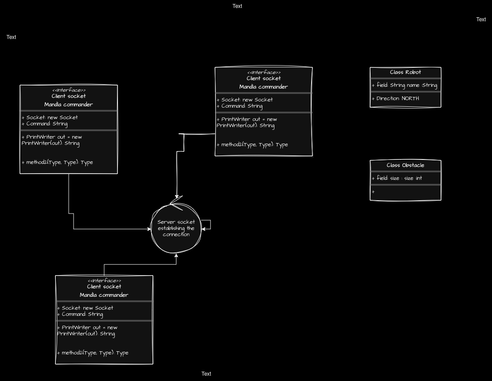

#  Client/Server program in Java 

This is a client Server project with a Team using java socket programming.
The server listens on a network port for robots that will inhabit the world. Once a connection is received, it is responsible for receiving instructions from each robot and updating the world based on the behaviour of each robot.


## Authors

- [Mandla7784](https://www.github.com/Mandla7784)
- [Ndumiso](https://www.github.com/Mandla7784)
- [Alex](https://www.github.com/Mandla7784)
- [Nomaqhawe](https://www.github.com/Mandla7784)


## Usage/Examples

```bash
   run the server file  
   run the client side and , prompot  "server name port" on the terminal

```


## Project structure
```bash
    src/main/java
    src/test/java
```
## Tool stack 

This project was built using the following technologies:

- **Java**
- **Maven**
- **JUnit** (for testing)
- **GitLab** (for version control and collaboration)

## Getting Started

1. Clone the repository:
   ```bash
   git clone https://gitlab.com/your-username/your-repo-name.git


## ER Model



## Flow Chart
## 🧑‍💻 User Stories


- As a **new user**, I want to connect my robot  to the server so that i can be able to make commands to control my robot.
- As a **returning user**, I want to continue where I left off.

- As a **developers**, We want to clone and run the project locally so that we can test features before pushing changes.
